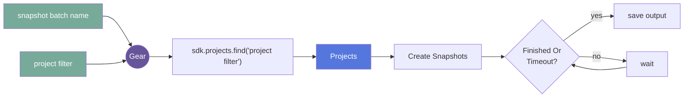
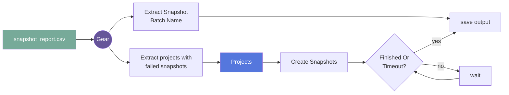

# sitewide-snapshot (Sitewide Snapshot)

## Overview

### Summary

Triggers snapshots across multiple projects based off a provided filter

### Classification

*Category:* utility

*Gear Level:*

- [x] Project
- [ ] Subject
- [ ] Session
- [ ] Acquisition
- [ ] Analysis

----

[[_TOC_]]

----

### Inputs

- *retry failed*
  - __Name__: *retry failed*
  - __Type__: *file*
  - __Optional__: *True*
  - __Classification__: *tabular data*
  - __Description__: *Retry failed snapshots in a csv output report generated by a previous run of the gear*

### Config

- *debug*
  - __Name__: *debug*
  - __Type__: *boolean*
  - __Description__: *Log debug messages*
  - __Default__: *False*

- *project filter*
  - __Name__: *project filter*
  - __Type__: *string*
  - __Description__: *A finder filter to use to select projects to include in the snapshot ('label=mylabel', 'group=mygroup', etc).  Will snapshot ALL matching projects.  If you want all projects snapshotted, enter 'ALL'"*
  - __Default__: None

- *snapshot batch name*
  - __Name__: *snapshot batch name*
  - __Type__: *string*
  - __Description__: *A name to associate with this batch of snapshots*
  - __Default__: None

### Outputs

#### Files

- *snapshot_report.csv*
  - __Name__: *snapshot_report.csv*
  - __Type__: *csv*
  - __Description__: *A csv report of every project ID a snapshot was created for, the associated snapshot ID, and the status of that snapshot*
  - __Notes__: *This is the file you would pass as input to the input "retry failed"*

#### Metadata

When a snapshot is created on a project, that snapshot will be visible to anyone
who has permissions to view that project.  It is possible that someone could
delete a snapshot created by this gear.  Because of this, it is recommended that
you download the snapshot objects created by this gear and store them in a 
location that you control.

### Pre-requisites

- User access to all projects you intend to snapshot

## Usage

This section provides a more detailed description of the gear, including not just WHAT it does, but HOW it works in flywheel.

### Description

When this gear runs, it executes a project-level finder using the flywheel 
python sdk, passing in the "project filter" config value as the finder filter.
It then loops over the results of that finder, and creates a snapshot for each
project.  The gear then waits for all snapshots to finish, or a preset timeout
to be reached.  The timeout is set for ten minutes. After all the snapshots
are finished (or the timeout is reached) and output CSV is generated with the 
project, snapshot ID, and status of each snapshot.  If any snapshots failed,
this csv can be passed back into the gear as the "retry failed" input, and the
gear will ONLY attempt to retry the failed snapshots.

#### File Specifications

##### *retry failed*

The snapshot_report.csv file generated as output from a previous run of this
gear.

### Workflow

#### Without a "retry failed" input file (normal run)

Description of workflow

1. Add a descriptive snapshot batch name to identify this batch
2. Add a project filter to select projects to snapshot
3. run the gear

#### With a "retry failed" input file

Description of workflow

1. Extract failed projects from the snapshot_report.csv file
2. Extract the snapshot batch name from the snapshot_report.csv file
3. Retry snapshots on the failed projects

### Use Cases

#### Snapshot of all projects on the instance

For when the user wants to create a snapshot of every project on the site.

__*Conditions__*:

- User has explicit access to every project on the site
- User puts the string "ALL" as the project filter

#### Snapshot of all projects in a group

For when the user wants to create a snapshot of every project in a certain 
group.

__*Conditions__*:

- User has explicit access to every project in the group
- User puts the string "group=group_name" as the project filter

#### Snapshot of all projects with labels that match a regular expression

For when the user wants to create a snapshot of every project with a particular
pattern in their label (for example, ".*-accepted")

__*Conditions__*:

- User has explicit access to every project that matches the regular expression
- User puts the string "label=~.*-accepted" as the project filter

### Logging

The log will simply state every project that it attempts to create a snapshot on.
## FAQ

[FAQ.md](FAQ.md)

## Contributing

[For more information about how to get started contributing to that gear,
checkout [CONTRIBUTING.md](CONTRIBUTING.md).]
<!-- markdownlint-disable-file -->
